README

# 3DViewer Project in Qt/CPP

The Viewer3D project is a C++ based 3D viewer application that enables users to load 3D models and perform various transformations and rendering operations on them. This README file contains important information about the project, including installation instructions, usage, development, and licensing.

## Build

To build the project, follow these steps:

1. Ensure that CMake version 3.15 or higher is installed on your system.
2. Clone the project repository to your local machine.
3. Open a terminal window and navigate to the project directory.
4. Create a new build directory within the project directory.
5. Navigate to the build directory and run the command `cmake ..` to generate the makefile.
6. Run the command `make` to build the project.

## Dependencies

The Viewer3D project has the following dependencies:

- CMake version 3.15 or higher
- C++ (CXX) and C languages
- CMake_INCLUDE_CURRENT_DIR variable set to ON
- CMake_AUTOUIC, CMake_AUTOMOC, and CMake_AUTORCC variables set to ON
- C standard version 11
- C++ standard version 17
- assimp library
- Qt libraries (version 5 or 6), specifically the Widgets and Gui components
- OpenGL, Qt5Core, Qt5Widgets, Qt5Gui, and Qt5OpenGL libraries (for Windows systems)
- QtOpenGL and OpenGLWidgets components (for non-Windows systems)

## Usage

The Viewer3D application provides the following functionalities:

1. Model Loading: The application allows loading 3D models from different file formats such as obj, stl, fbx, dae, etc. These models can include vertices, surfaces, normals, textures, and other attributes.
 
2. Transformations: Translation, rotation, and scaling of models are essential features in the application. Users can move, rotate or scale models to create animations or position them in the desired location in the scene.

3. User Interface: The application provides a graphical user interface (GUI) for easy interaction with the software. The GUI allows users to select different tools and options, and to modify various properties of the models, such as lighting, materials, textures, and rendering options.

To use the Viewer3D application, follow these steps:

1. Launch the application.
2. Load a 3D model by selecting the "File" menu and choosing "Open Model."
3. Use the transformation tools to move, rotate or scale the loaded model.
4. Modify the rendering options as desired using the options available in the GUI.
5. Save the modified model if needed by selecting the "File" menu and choosing "Save Model."

Development:

If you would like to contribute to the development of the 3DViewer project, please follow these steps:

1. Fork the project on GitHub.
2. Clone your forked repository to your local machine.
3. Make changes to the code and test them locally.
4. Commit your changes and push them to your forked repository.
5. Create a pull request on the main repository.

Please note that all contributions must be made under the project's license, which is described below.

License:

The Viewer3D project is licensed under the [MIT License](LICENSE). This means that the project can be used for both commercial and non-commercial purposes, and that anyone is free to modify and distribute the source code. However, the project is provided "as is", without warranty of any kind, and the authors of the project will not be held liable for any damages arising from the use of the project.

<h1 align="center"> 3DViewer </h1>

<h2 align="center"> Main window view </h2>

1. Object display area
2. Basic application settings
3. Object/scene control area
4. Light control area
5. Texture control area

With the three areas described above, it is possible to perform various manipulations (display over the object display area, close/open, resize and reposition), for example:

<h2 align="center"> Basic Settings </h2>
<h3><b> File tab: </b></h3>

1. Load the model from a file (obj format)
2. Take a snapshot of the current state of the display area, which opens an additional window (screenshot below) for choosing the image format and resolution that the user can set manually or select from corresponding presets. 

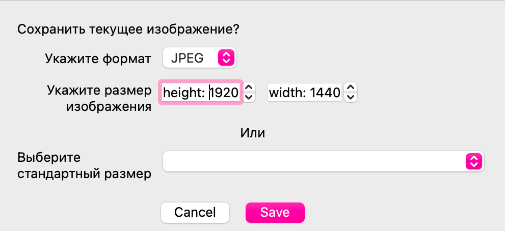

<h3><b> Model tab: </b></h3>

1. Edges
    - Display mode (default is none)
        - none - do not display edges on the object
        - line - display edges as lines
    - Size - change the thickness of lines
    - Color - change the color of lines
2. Vertices
    - Display mode (default is none)
        - none - do not display vertices on the object
        - Circle - display vertices as circles
        - Square - display vertices as squares
    - Size - change the radius of points
    - Color - change the color of points
3. Textures
    - Display mode (default is surface)
        - none - do not display textures
        - Wireframe - display a wireframe model of the object
        - Surface - display the object as surfaces

 When changing the line thickness, an auxiliary window is displayed with a visual representation of the thickness and the ability to change it: 

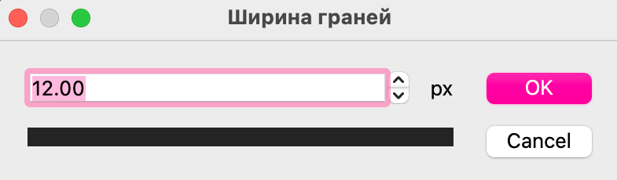

<h2 align="center"> Examples: </h2>

| Edge display method |  | Fin thickness |  | Rib color |  |
| :---: | :---: | :---: | :---: | :---: | :---: |
| `none` |  | `defaut` |  | `defaut` |  |
| `Линия` |  | `default++` |  | `pink` |  |

| Way of displaying vertices |  | Vertex Radius |  | Vertex color |  |
| :---: | :---: | :---: | :---: | :---: | :---: |
| `none` |  | `defaut` |  | `defaut` |  |
| `Круг` |  | `default++` |  | `pink` |  |
| `Квадрат` |  |

| Texture rendering method | `none` | `Frame` | `Surface` |
| :---: | :---: | :---: | :---: | 
| |  |  |  |

<h3><b> Scene tab: </b></h3>

1. Color - Change the color of the scene (displayed correctly only when environment is disabled)
2. Lighting
    - Flat shading - even shading across the entire polygon
    - Smooth shading - uses a gradient to change the color of the polygon
3. Projection type
    - Central
    - Parallel
4. Grid (coordinate axes and squares in space)
    - none
    - Display
5. Smoothing
    - Hard edges
    - Soft edges
6. Environment (landscape around the object)
    - none
    - Display

<h2 align="center"> Examples: </h2>

| `Stage yellow` | `Stage green` |
| :---: | :---: | 
| 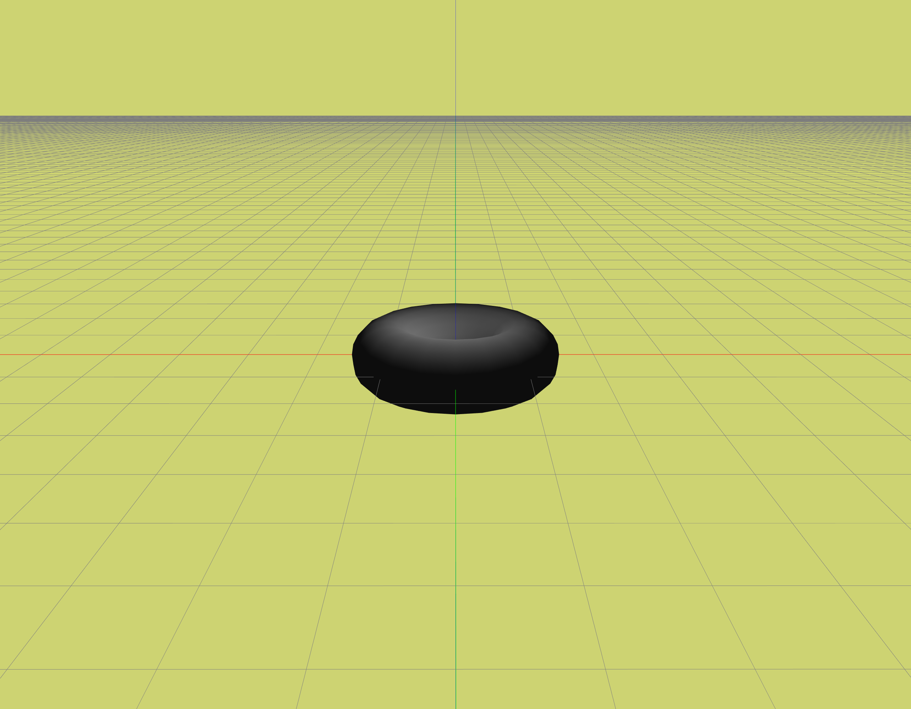 | 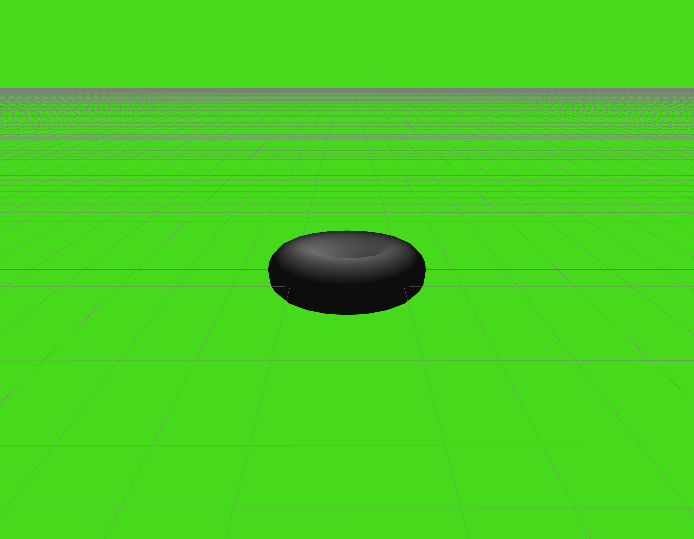 |

| `Flat shading` | `Soft shading` |
| :---: | :---: | 
|  | 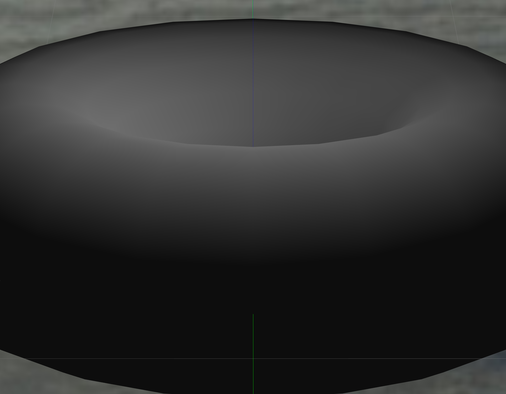 |

| `Central projection` | `Parallel Projection` |
| :---: | :---: | 
|  | 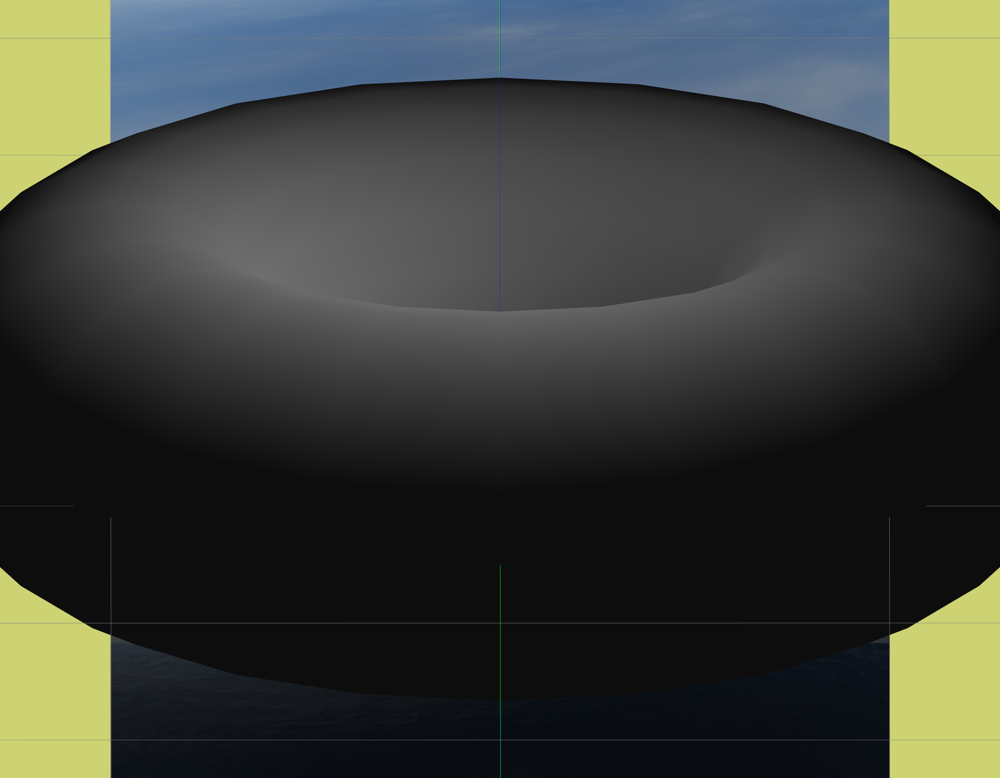 |

| `Show grid` | `Grid none` |
| :---: | :---: | 
|  |  |

| `Display environment` | `Environment none` |
| :---: | :---: | 
|  |  |

<h2 align="center"> Object Control Area </h2>

<table align="center">
<tr> 
    <td> 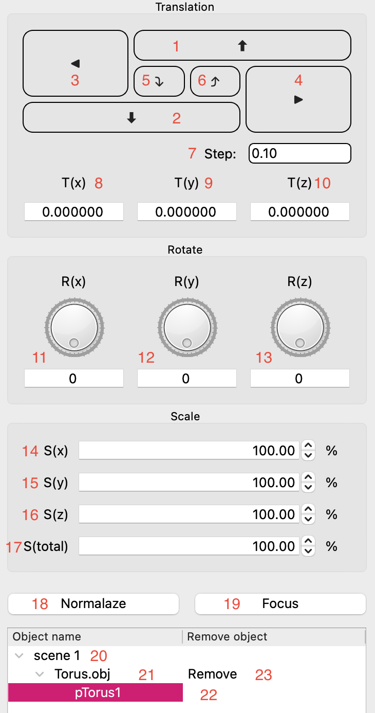 </td>
    <td>

        1-2. Offset along X-axis  
        3-4. Offset along Y-axis  
        5-6. Offset along Z-axis  
        1. Offset step  
        2. Current coordinate on X-axis  
        3. Current coordinate on Y-axis  
        4.  Current coordinate on Z-axis  
        5.  Rotation around X-axis  
        6.  Rotation around Y-axis  
        7.  Rotation around Z-axis  
        8.  Proportional model scaling along X-axis  
        9.  Proportional model scaling along Y-axis  
        10. Proportional model scaling along Z-axis  
        11. Proportional model scaling along all axes simultaneously  
        12. Scales object dimensions to unity size  
        13. Focuses camera on selected object  
        14. When selecting the scene, user will modify parameters of all objects  
        15. When selecting a specific object, user will modify parameters of that object  
        16. When selecting a specific part of an object, user can only modify materials for that part  
        17. Clicking the remove field next to an object removes it from the scene
    
</td>
</tr>
</table>

<h2 align="center"> Examples: </h2>

| `Оригинал` | `Смещение по X` | `Смещение по Y` | `Смещение по Z` |
| :---: | :---: | :---: | :---: | 
|  |  |  |  |
| `Поворот по X` | `Поворот по Y (по Z 45)` | `Поворот по Z` | `Total scale` |
|  |  |  | 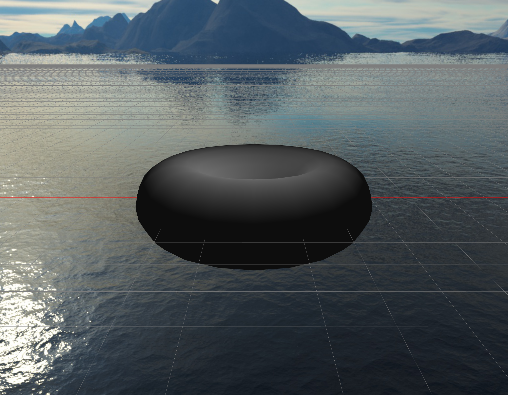 |
| `Scale X` | `Scale Y` | `Scale Z` | `Normalize` |
|  |  |  |  |

<h2 align="center"> Light Control Area </h2>

<table align="center">
<tr> 
    <td> 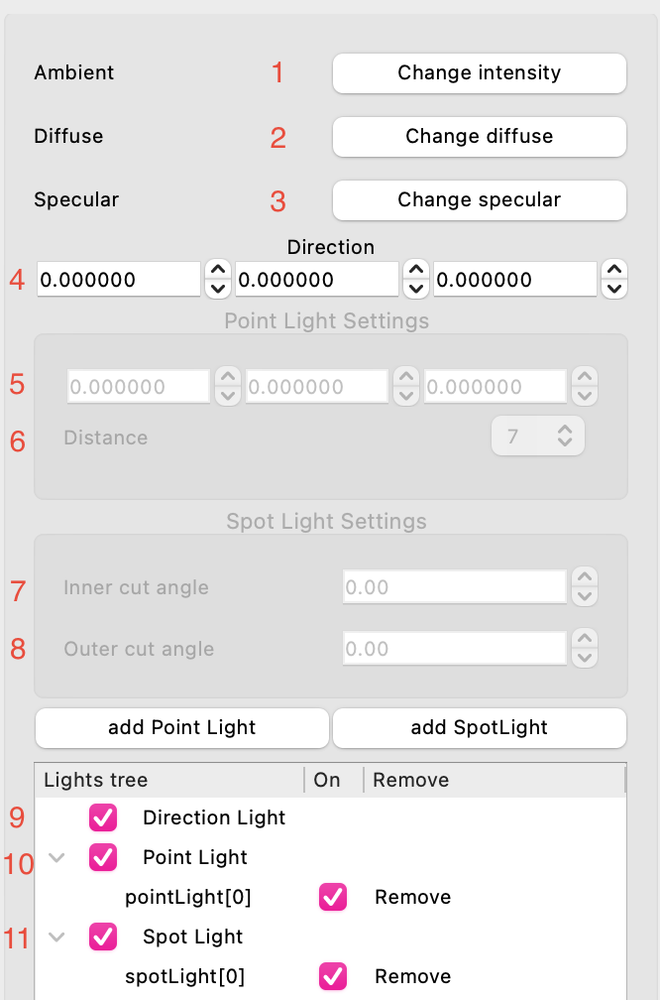 </td>
    <td>

        1. Object emission color  
        2. Diffuse color of scattered light  
        3. Color of reflected light  
        4. Direction of the light source  
        5. Position of the light source in space  
        6. Ray distance  
        7. Inner circle of illuminated space  
        8. Outer circle of light scattering zone  
        9. Global light source status  
        10. Positional light source status and their list  
        11. Narrow directional positional light source status and their list
    
</td>
</tr>
</table>

<h2 align="center"> Texture Control Area </h2>

<table align="center">
<tr> 
    <td> 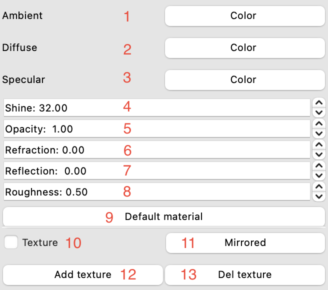 </td>
    <td>

        1. Background lighting  
        2. Diffuse lighting  
        3. Lighting of specular highlights  
        4. Glossiness coefficient  
        5. Transparency coefficient  
        6. Refraction coefficient  
        7. Reflection coefficient  
        8. Roughness coefficient  
        9. Set default values for all coefficients 
        10. Enable/disable display of the uploaded texture 
        11. Flip the texture 
        12. Add a texture 
        13. Remove a texture
    
</td>
</tr>
</table>

<h2 align="center"> Examples: </h2>

| `Specular Highlight` | `Reflection` | `Transparency` |
| :---: | :---: | :---: |
|  |  | 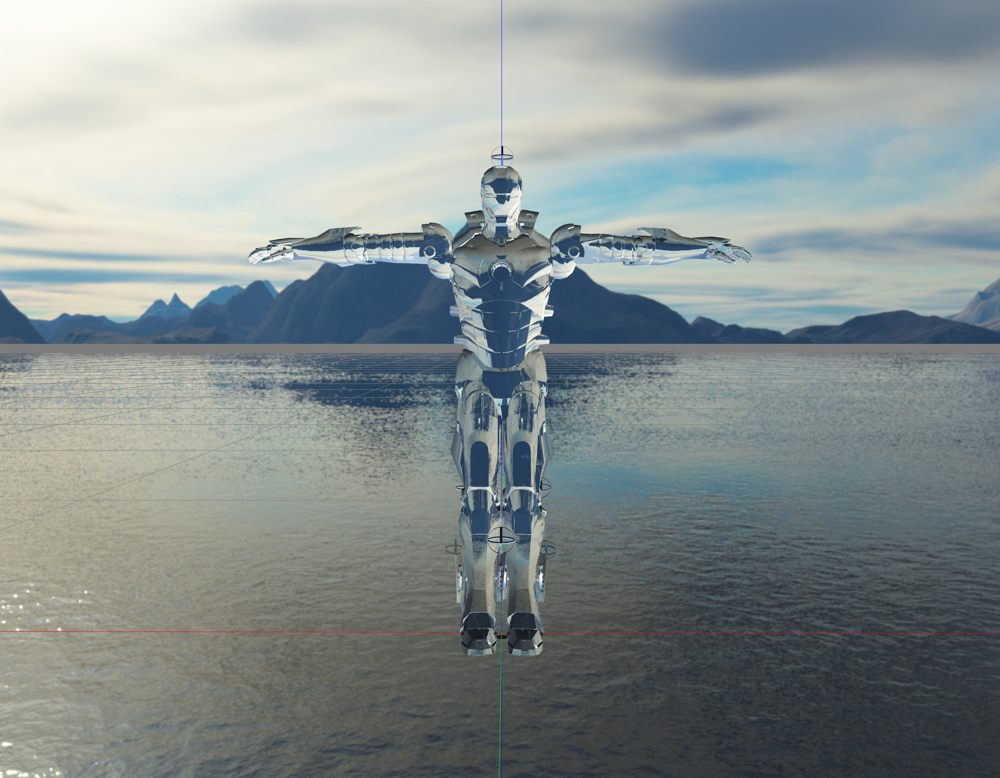 |

